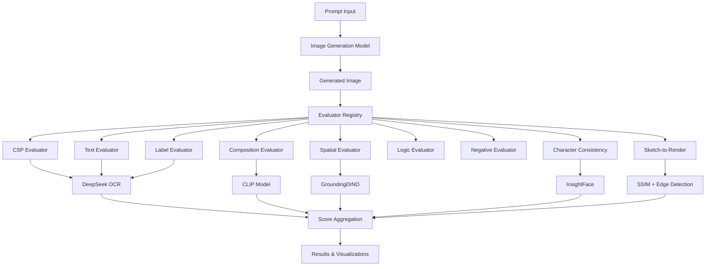
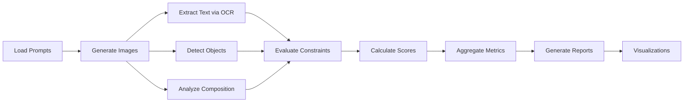
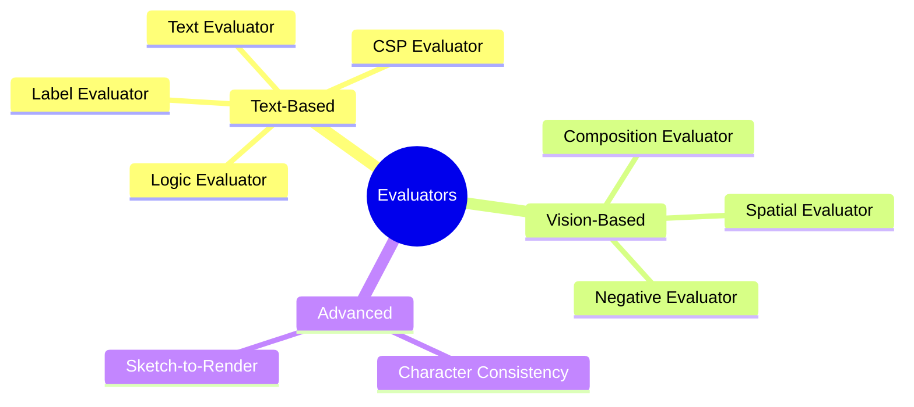

# Visual Instruction Following Evaluation Benchmark

> A comprehensive, production-ready benchmark for evaluating visual instruction following capabilities of modern image generation models. This benchmark rigorously tests whether generated images satisfy complex prompts with multiple constraints including object counts, text rendering, spatial relationships, and compositional requirements.

## Overview

The Visual Instruction Following Evaluation Benchmark (vis_ifeval) is a systematic framework for assessing how well image generation models follow detailed visual instructions. Unlike simple text-to-image benchmarks, vis_ifeval evaluates models on their ability to handle:

- **Complex Constraints**: Multiple simultaneous requirements (8-12 per prompt)
- **Precision Tasks**: Exact text rendering, numeric accuracy, spatial relationships
- **Compositional Reasoning**: Object counts, attributes, states, and relationships
- **Real-World Scenarios**: Nutrition labels, character consistency, sketch-to-render tasks

The benchmark includes 9 specialized evaluators, 13 CSP constraint types, and supports evaluation of leading models including OpenAI DALL-E 3, GPT Image 1, and Google Gemini.

## Key Features

- **Multi-Model Support**: Evaluate OpenAI DALL-E 3, GPT Image 1, Google Gemini, and custom models
- **Comprehensive Evaluators**: 9 evaluator types covering text, composition, spatial relationships, logic, and more
- **Advanced OCR**: DeepSeek-OCR as primary OCR backend for high-accuracy text extraction (Tesseract as automatic fallback)
- **Constraint Satisfaction**: 13 CSP constraint types for rigorous evaluation
- **Automated Pipeline**: End-to-end evaluation from image generation to metric aggregation
- **Rich Visualizations**: Performance heatmaps, radar charts, and detailed analysis reports

## Architecture



## Evaluation Pipeline



## Evaluator Types



## Installation

### Prerequisites

- Python 3.10 or higher
- pip package manager

### Quick Install

```bash
# Clone the repository
git clone https://github.com/vinitwadgaonkar/vis_ifeval.git
cd vis_ifeval

# Create virtual environment (recommended)
python3 -m venv venv
source venv/bin/activate  # On Windows: venv\Scripts\activate

# Install dependencies
pip install --upgrade pip
pip install -r requirements.txt
pip install -e .
```

### OCR Backend

**DeepSeek-OCR** is the primary OCR backend and will be automatically downloaded from Hugging Face on first use. No manual installation required.

**Tesseract OCR** is used as an automatic fallback if DeepSeek fails. Installation is optional but recommended:
- macOS: `brew install tesseract`
- Ubuntu/Debian: `sudo apt-get install tesseract-ocr`
- Windows: Download from [GitHub](https://github.com/UB-Mannheim/tesseract/wiki)

### Optional ML Dependencies

For advanced evaluators (automatically installed via requirements.txt):
```bash
pip install torch torchvision torchaudio
pip install groundingdino-py insightface onnxruntime ultralytics
```

## Quick Start

### 1. Configure API Keys

Set environment variables for API-based models:

```bash
export OPENAI_API_KEY='your-openai-api-key'
export OPENROUTER_API_KEY='your-openrouter-api-key'  # For Gemini models
export VIS_IFEVAL_OCR_BACKEND='deepseek'  # Use DeepSeek OCR (default)
```

Or create a `.env` file:
```bash
OPENAI_API_KEY=your-key-here
OPENROUTER_API_KEY=your-key-here
VIS_IFEVAL_OCR_BACKEND=deepseek
```

### 2. Run Evaluation

```bash
# Run full evaluation for a specific model
python scripts/evaluation/run_full_evaluation.py --model gpt-image-1

# Test all evaluators
python scripts/evaluation/test_all_evaluators.py

# Run evaluation for multiple models
python scripts/utils/run_all_models.py --models gpt-image-1,nano-banana,dalle3
```

### 3. View Results

Results are saved in `results/` directory:
- `results/{model_name}/results.json` - Complete evaluation results
- `results/{model_name}/images/` - Generated images
- `results/comparison_data.json` - Cross-model comparison

## Usage

### Basic Evaluation

```python
from vis_ifeval.models.openai_model import OpenAIModel
from vis_ifeval.evaluators import EvaluatorRegistry
from vis_ifeval.utils.ocr_backend import build_text_backend

# Initialize model
model = OpenAIModel(model="gpt-image-1", size="1024x1024", quality="high")

# Generate image
image = model.generate("A red cube on top of a blue sphere")

# Initialize evaluators with DeepSeek OCR
ocr_backend = build_text_backend("deepseek")
registry = EvaluatorRegistry(ocr_backend=ocr_backend)

# Evaluate constraints
constraints = [
    {"type": "count", "object": "cube", "target": 1},
    {"type": "attribute", "object": "cube", "attribute": "color", "value": "red"}
]

scores = []
for constraint in constraints:
    evaluator = registry.get_evaluator(constraint["type"])
    score = evaluator.score(image, constraint)
    scores.append(score)
```

### Command Line Interface

```bash
# Run CSP evaluation
python scripts/evaluation/run_csp_evaluation.py

# Run evaluation for DALL-E 3
python scripts/evaluation/run_evaluation_dalle3.py

# Run evaluation for Nano Banana (Gemini)
python scripts/evaluation/run_evaluation_nano_banana.py

# Test special evaluators (character consistency, sketch-to-render)
python scripts/evaluation/test_special_evaluators.py --model both
```

### Analysis and Visualization

```bash
# Generate visualizations
python scripts/analysis/create_visualizations.py

# Create case studies
python scripts/analysis/create_case_studies.py

# Analyze errors
python scripts/analysis/analyze_errors.py
```

## Project Structure

```
vis_ifeval/
├── src/vis_ifeval/          # Main package
│   ├── models/              # Image generation models
│   │   ├── openai_model.py
│   │   ├── openrouter_model.py
│   │   └── base_model.py
│   ├── evaluators/          # Constraint evaluators
│   │   ├── csp_eval.py      # CSP constraints
│   │   ├── text_eval.py     # Text rendering
│   │   ├── comp_eval.py     # Composition (count, attribute, state)
│   │   ├── spatial_eval.py  # Spatial relationships
│   │   ├── logic_eval.py    # Logic consistency
│   │   ├── label_eval.py    # Nutrition labels
│   │   ├── character_consistency_eval.py
│   │   └── sketch_to_render_eval.py
│   ├── utils/               # Utilities
│   │   ├── ocr_backend.py   # OCR abstraction (DeepSeek primary, Tesseract fallback)
│   │   └── clip_utils.py    # CLIP utilities
│   └── config.py            # Configuration
├── scripts/
│   ├── evaluation/          # Evaluation scripts
│   ├── analysis/            # Analysis and visualization
│   ├── paper/               # Paper generation
│   └── utils/               # Utility scripts
├── prompts/                 # Test prompts (JSONL format)
├── results/                 # Evaluation results
├── docs/                    # Documentation
└── paper/                   # Paper assets and reports
```

## Evaluators

The benchmark includes 9 evaluator types:

1. **CSP Evaluator**: Constraint satisfaction (numeric relations, sums, ranges, etc.)
2. **Text Evaluator**: Text rendering accuracy using DeepSeek-OCR
3. **Label Evaluator**: Nutrition label parsing and validation using DeepSeek-OCR
4. **Composition Evaluator**: Object counts, attributes, and states (CLIP-based)
5. **Spatial Evaluator**: Spatial relationships using GroundingDINO
6. **Logic Evaluator**: Logical consistency checks
7. **Negative Evaluator**: Absence checks (CLIP-based)
8. **Character Consistency Evaluator**: Face recognition and consistency
9. **Sketch-to-Render Evaluator**: Structural fidelity and style matching

## OCR Backend

The benchmark uses **DeepSeek-OCR** (`deepseek-ai/DeepSeek-OCR`) as the primary OCR backend for all text extraction tasks. DeepSeek-OCR provides:

- High accuracy text extraction
- Automatic model download from Hugging Face
- GPU acceleration when available
- Automatic fallback to Tesseract if DeepSeek fails

To use DeepSeek OCR (default):
```bash
export VIS_IFEVAL_OCR_BACKEND='deepseek'
```

## OCR Backend

The benchmark uses **DeepSeek-OCR** (`deepseek-ai/DeepSeek-OCR`) as the primary OCR backend for all text extraction tasks. DeepSeek-OCR provides:

- High accuracy text extraction
- Automatic model download from Hugging Face
- GPU acceleration when available
- Automatic fallback to Tesseract if DeepSeek fails

To use DeepSeek OCR (default):
```bash
export VIS_IFEVAL_OCR_BACKEND='deepseek'
```

## Prompt Format

Prompts are stored in JSONL format. Each line is a JSON object:

```json
{
  "id": "csp_001",
  "category": "csp",
  "prompt": "A nutrition label showing Total: 28, Sodium: 50mg 2%",
  "constraints": [
    {
      "id": "total_sum",
      "type": "csp",
      "kind": "sum_equals",
      "fields": ["Total"],
      "target": 28
    }
  ]
}
```

## Configuration

Configuration is managed through environment variables:

- `OPENAI_API_KEY`: OpenAI API key for DALL-E and GPT Image models
- `OPENROUTER_API_KEY`: OpenRouter API key for Gemini models
- `VIS_IFEVAL_OCR_BACKEND`: OCR backend (`deepseek` default, `tesseract` for fallback)
- `VIS_IFEVAL_USE_WANDB`: Enable Weights & Biases logging (optional)

## Results

Evaluation results include:

- **Pass Rates**: Percentage of constraints satisfied per category
- **Scores**: Detailed scores for each constraint type
- **Error Analysis**: Common failure patterns and error categorization
- **Cost Analysis**: API costs and latency metrics
- **Visualizations**: Performance heatmaps, radar charts, and comparisons

Results are saved in JSON format and can be visualized using the analysis scripts.

## Documentation

- [Evaluation Logic](docs/evaluation/evaluation_logic.txt) - Detailed evaluation methodology
- [Evaluation Metrics](docs/evaluation/evaluation_metrics.txt) - Complete metrics documentation
- [Architecture](docs/technical/ARCHITECTURE.md) - System architecture
- [MacBook Setup](SETUP_MACBOOK.md) - Setup guide for macOS
- [Quick Start Guide](QUICK_START_MAC.md) - Quick reference

## Contributing

Contributions are welcome! Please feel free to submit a Pull Request.

## License

[Add your license here]

## Citation

If you use this benchmark in your research, please cite:

```bibtex
@software{vis_ifeval,
  title = {Visual Instruction Following Evaluation Benchmark},
  author = {Wadgaonkar, Vinit},
  year = {2024},
  url = {https://github.com/vinitwadgaonkar/vis_ifeval}
}
```

## Acknowledgments

- DeepSeek-OCR for advanced OCR capabilities
- OpenAI, Google, and other model providers
- The open-source community for various tools and libraries
