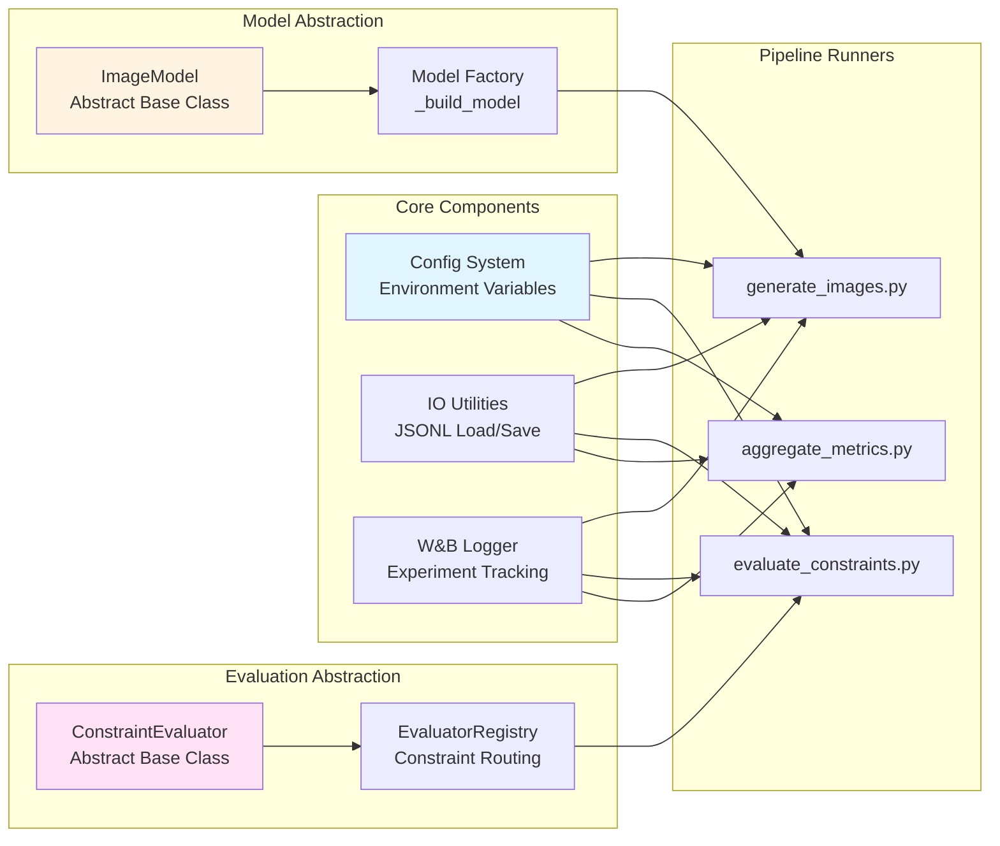
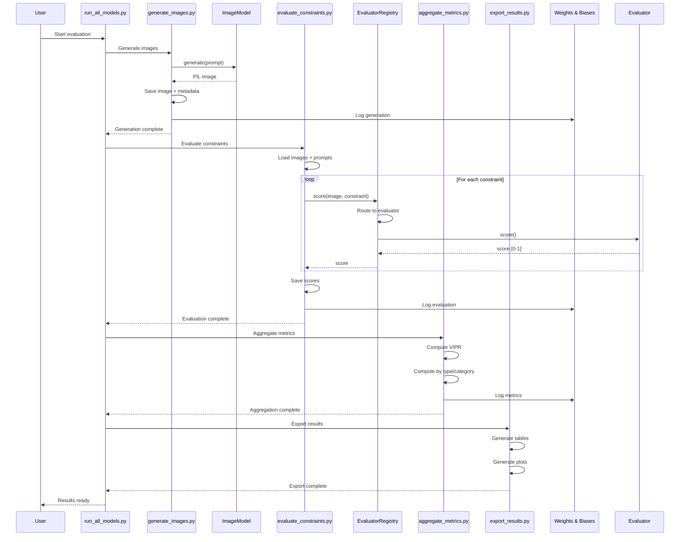

# System Architecture

## Visual Instruction Following Evaluation Benchmark (vis_ifeval)

This document describes the system architecture of the vis_ifeval benchmark.

## High-Level Architecture Diagram

```mermaid
graph TB
    subgraph "Input Layer"
        PROMPTS[Prompts JSONL<br/>23 prompts, 143 constraints]
    end

    subgraph "Model Layer"
        subgraph "Local Models"
            DUMMY[DummyModel<br/>Random Images]
            SDXL[SDXLModel<br/>Stable Diffusion XL]
            SD3[SD3Model<br/>Stable Diffusion 3]
            FLUX[FluxModel<br/>FLUX.1-dev]
        end
        
        subgraph "API Models"
            OPENAI[OpenAIModel<br/>DALL-E 3/2]
            GEMINI[GeminiModel<br/>Gemini 2.5 Flash]
            NOVELAI[NovelAIModel<br/>NovelAI Diffusion]
            BANANA[BananaModel<br/>Banana.dev]
            REPLICATE[ReplicateModel<br/>Replicate API]
            STABILITY[StabilityAPIModel<br/>Stability AI]
        end
        
        BASE[ImageModel<br/>Base Interface]
    end

    subgraph "Generation Pipeline"
        GEN[generate_images.py<br/>Image Generation Runner]
        GEN_OUT[Generated Images<br/>data/outputs/]
        GEN_META[Generation Metadata<br/>results/generation_*.jsonl]
    end

    subgraph "Evaluation Layer"
        subgraph "Evaluator Registry"
            REGISTRY[EvaluatorRegistry<br/>Routes constraints to evaluators]
        end
        
        subgraph "Constraint Evaluators"
            TEXT_EVAL[TextEvaluator<br/>OCR-based text matching]
            LABEL_EVAL[LabelEvaluator<br/>Nutrition label parsing]
            LOGIC_EVAL[LogicEvaluator<br/>Consistency checks]
            NEG_EVAL[NegativeEvaluator<br/>CLIP-based negative checks]
            COMP_EVAL[CompositionEvaluator<br/>Count, Attribute, State]
            SPATIAL_EVAL[SpatialEvaluator<br/>Spatial relations - Stub]
        end
        
        subgraph "Supporting Services"
            OCR[OCR Backend<br/>TesseractBackend]
            CLIP[CLIP Wrapper<br/>open_clip_torch]
        end
        
        EVAL[evaluate_constraints.py<br/>Constraint Evaluation Runner]
        EVAL_OUT[Evaluation Scores<br/>results/scores_*.jsonl]
    end

    subgraph "Aggregation Layer"
        AGG[aggregate_metrics.py<br/>Metrics Aggregation]
        METRICS[VIPR Metrics<br/>results/metrics_*.json]
    end

    subgraph "Export & Visualization"
        EXPORT[export_results.py<br/>Results Export]
        TABLES[Markdown/CSV Tables<br/>results/tables/]
        PLOTS[Matplotlib Plots<br/>results/plots/]
    end

    subgraph "External Services"
        WANDB[Weights & Biases<br/>Experiment Tracking]
        API_SERVICES[API Services<br/>OpenAI, Google, etc.]
    end

    subgraph "Automation"
        MULTI[run_all_models.py<br/>Multi-Model Runner]
    end

    %% Input flow
    PROMPTS --> GEN

    %% Model selection
    GEN --> BASE
    BASE --> DUMMY
    BASE --> SDXL
    BASE --> SD3
    BASE --> FLUX
    BASE --> OPENAI
    BASE --> GEMINI
    BASE --> NOVELAI
    BASE --> BANANA
    BASE --> REPLICATE
    BASE --> STABILITY

    %% API connections
    OPENAI --> API_SERVICES
    GEMINI --> API_SERVICES
    NOVELAI --> API_SERVICES
    BANANA --> API_SERVICES
    REPLICATE --> API_SERVICES
    STABILITY --> API_SERVICES

    %% Generation flow
    GEN --> GEN_OUT
    GEN --> GEN_META
    GEN --> WANDB

    %% Evaluation flow
    GEN_OUT --> EVAL
    PROMPTS --> EVAL
    EVAL --> REGISTRY
    REGISTRY --> TEXT_EVAL
    REGISTRY --> LABEL_EVAL
    REGISTRY --> LOGIC_EVAL
    REGISTRY --> NEG_EVAL
    REGISTRY --> COMP_EVAL
    REGISTRY --> SPATIAL_EVAL
    
    TEXT_EVAL --> OCR
    LABEL_EVAL --> OCR
    LOGIC_EVAL --> OCR
    NEG_EVAL --> CLIP
    COMP_EVAL --> CLIP
    
    EVAL --> EVAL_OUT
    EVAL --> WANDB

    %% Aggregation flow
    EVAL_OUT --> AGG
    AGG --> METRICS
    AGG --> WANDB

    %% Export flow
    METRICS --> EXPORT
    EXPORT --> TABLES
    EXPORT --> PLOTS

    %% Automation
    MULTI --> GEN
    MULTI --> EVAL
    MULTI --> AGG

    style PROMPTS fill:#e1f5ff
    style BASE fill:#fff4e1
    style REGISTRY fill:#ffe1f5
    style OCR fill:#e1ffe1
    style CLIP fill:#e1ffe1
    style WANDB fill:#f5e1ff
    style API_SERVICES fill:#ffe1e1
```



## Component Architecture



## Data Flow Diagram



## Model Integration Architecture

```mermaid
graph TB
    subgraph "Model Interface"
        BASE[ImageModel<br/>Abstract Base Class<br/>- name: str<br/>- config: dict<br/>- generate(prompt, seed)]
    end

    subgraph "Local Models"
        DUMMY[DummyModel<br/>- Generates random noise<br/>- No dependencies]
        SDXL[SDXLModel<br/>- diffusers library<br/>- torch<br/>- ~7GB download]
        SD3[SD3Model<br/>- diffusers library<br/>- torch<br/>- ~5GB download]
        FLUX[FluxModel<br/>- diffusers library<br/>- torch<br/>- ~24GB download]
    end

    subgraph "API Models"
        OPENAI[OpenAIModel<br/>- openai library<br/>- OPENAI_API_KEY]
        GEMINI[GeminiModel<br/>- google-generativeai<br/>- GEMINI_API_KEY]
        NOVELAI[NovelAIModel<br/>- requests<br/>- NOVELAI_API_KEY]
        BANANA[BananaModel<br/>- requests<br/>- BANANA_API_KEY<br/>- BANANA_MODEL_KEY]
        REPLICATE[ReplicateModel<br/>- replicate<br/>- REPLICATE_API_TOKEN]
        STABILITY[StabilityAPIModel<br/>- requests<br/>- STABILITY_API_KEY]
    end

    BASE --> DUMMY
    BASE --> SDXL
    BASE --> SD3
    BASE --> FLUX
    BASE --> OPENAI
    BASE --> GEMINI
    BASE --> NOVELAI
    BASE --> BANANA
    BASE --> REPLICATE
    BASE --> STABILITY

    style BASE fill:#fff4e1
    style DUMMY fill:#e1ffe1
    style SDXL fill:#ffe1e1
    style OPENAI fill:#e1f5ff
```

## Evaluation Architecture

```mermaid
graph TB
    subgraph "Input"
        IMG[Generated Image<br/>PIL.Image]
        PROMPT[Prompt Dict<br/>- id, category, prompt<br/>- constraints[]]
        CONSTRAINT[Constraint Dict<br/>- id, type, ...]
    end

    subgraph "Evaluator Registry"
        REG[EvaluatorRegistry<br/>- Routes by constraint type<br/>- Returns first match]
    end

    subgraph "Text-Based Evaluators"
        TEXT[TextEvaluator<br/>- OCR extraction<br/>- Text matching<br/>- Levenshtein distance]
        LABEL[LabelEvaluator<br/>- OCR extraction<br/>- Table parsing<br/>- Field matching]
        LOGIC[LogicEvaluator<br/>- Consistency checks<br/>- Math validation]
    end

    subgraph "Vision-Based Evaluators"
        NEG[NegativeEvaluator<br/>- CLIP embeddings<br/>- Similarity scoring<br/>- Negative concepts]
        COMP[CompositionEvaluator<br/>- CLIP embeddings<br/>- Count/Attribute/State<br/>- Heuristic scoring]
        SPATIAL[SpatialEvaluator<br/>- Object detection<br/>- Spatial relations<br/>- STUB: Returns 0.0]
    end

    subgraph "Supporting Services"
        OCR_SVC[OCR Backend<br/>- TesseractBackend<br/>- AdvancedBackend (stub)]
        CLIP_SVC[CLIP Wrapper<br/>- open_clip_torch<br/>- Graceful degradation]
    end

    IMG --> REG
    PROMPT --> REG
    CONSTRAINT --> REG

    REG -->|type: text| TEXT
    REG -->|type: table_slot| LABEL
    REG -->|type: percent_dv_consistency| LOGIC
    REG -->|type: negative| NEG
    REG -->|type: count/attribute/state| COMP
    REG -->|type: spatial| SPATIAL

    TEXT --> OCR_SVC
    LABEL --> OCR_SVC
    LOGIC --> OCR_SVC
    NEG --> CLIP_SVC
    COMP --> CLIP_SVC

    TEXT -->|score: 0.0-1.0| OUTPUT[Evaluation Score]
    LABEL -->|score: 0.0-1.0| OUTPUT
    LOGIC -->|score: 0.0-1.0| OUTPUT
    NEG -->|score: 0.0-1.0| OUTPUT
    COMP -->|score: 0.0-1.0| OUTPUT
    SPATIAL -->|score: 0.0| OUTPUT

    style REG fill:#ffe1f5
    style OCR_SVC fill:#e1ffe1
    style CLIP_SVC fill:#e1ffe1
    style SPATIAL fill:#ffe1e1
```

## File Structure

```
vis_ifeval/
├── src/vis_ifeval/
│   ├── __init__.py
│   ├── config.py                    # Configuration management
│   │
│   ├── models/                      # Image Generation Models
│   │   ├── __init__.py
│   │   ├── base_model.py            # Abstract ImageModel interface
│   │   ├── dummy_model.py           # Random image generator
│   │   ├── sdxl_model.py            # Stable Diffusion XL (local)
│   │   ├── sd3_model.py             # Stable Diffusion 3 (local)
│   │   ├── flux_model.py            # FLUX.1-dev (local)
│   │   ├── openai_model.py          # DALL-E 3/2 (API)
│   │   ├── gemini_model.py          # Gemini 2.5 Flash (API)
│   │   ├── novelai_model.py         # NovelAI (API)
│   │   ├── banana_model.py          # Banana.dev (API)
│   │   ├── replicate_model.py       # Replicate (API)
│   │   └── stability_api_model.py   # Stability AI (API)
│   │
│   ├── evaluators/                  # Constraint Evaluators
│   │   ├── __init__.py              # EvaluatorRegistry
│   │   ├── base.py                  # Abstract ConstraintEvaluator
│   │   ├── text_eval.py             # Text constraint evaluation
│   │   ├── label_eval.py            # Nutrition label evaluation
│   │   ├── logic_eval.py            # Logic consistency evaluation
│   │   ├── negative_eval.py         # Negative constraint (CLIP)
│   │   ├── comp_eval.py             # Composition (count/attr/state)
│   │   └── spatial_eval.py          # Spatial relations (stub)
│   │
│   ├── runners/                     # Pipeline Runners
│   │   ├── __init__.py
│   │   ├── generate_images.py       # Step 1: Generate images
│   │   ├── evaluate_constraints.py  # Step 2: Evaluate constraints
│   │   └── aggregate_metrics.py     # Step 3: Aggregate metrics
│   │
│   └── utils/                       # Utilities
│       ├── __init__.py
│       ├── io.py                    # JSONL load/save
│       ├── ocr_backend.py           # OCR abstraction
│       ├── clip_utils.py            # CLIP wrapper
│       ├── wandb_logger.py          # W&B integration
│       └── export_results.py        # Results export
│
├── scripts/
│   └── run_all_models.py            # Multi-model automation
│
├── prompts/
│   └── prompts.jsonl                # 23 prompts, 143 constraints
│
├── data/
│   └── outputs/                     # Generated images
│       └── {model_name}/
│           └── {prompt_id}.png
│
├── results/
│   ├── generation_{model}.jsonl     # Generation metadata
│   ├── scores_{model}.jsonl         # Evaluation scores
│   ├── metrics_{model}.json         # Aggregated metrics
│   ├── combined_results.json        # Multi-model summary
│   ├── tables/                      # Exported tables
│   │   ├── model_vipr_table.md
│   │   └── model_vipr_table.csv
│   └── plots/                       # Exported plots
│       ├── vipr_bar_chart.png
│       └── vipr_per_category.png
│
├── requirements.txt                 # Python dependencies
├── README.md                        # Main documentation
├── ARCHITECTURE.md                  # This file
└── API_MODELS_GUIDE.md             # API model setup guide
```

## Key Design Patterns

### 1. **Strategy Pattern** (Models)
- `ImageModel` abstract base class
- Multiple implementations (local vs API)
- Runtime selection via factory pattern

### 2. **Chain of Responsibility** (Evaluators)
- `EvaluatorRegistry` routes constraints
- Each evaluator checks `can_handle()`
- First matching evaluator processes constraint

### 3. **Template Method** (Pipeline)
- Three-stage pipeline (generate → evaluate → aggregate)
- Consistent structure across models
- Extensible for new stages

### 4. **Dependency Injection** (Services)
- OCR backend injected into evaluators
- CLIP wrapper shared across evaluators
- Graceful degradation for optional dependencies

## Technology Stack

### Core
- **Python 3.10+**: Main language
- **PIL/Pillow**: Image processing
- **NumPy**: Numerical operations

### Image Generation
- **diffusers**: Local models (SDXL, SD3, FLUX)
- **torch**: PyTorch for local inference
- **openai**: OpenAI API client
- **google-generativeai**: Gemini API client
- **replicate**: Replicate API client
- **requests**: HTTP for API models

### Evaluation
- **pytesseract**: OCR text extraction
- **python-Levenshtein**: String similarity
- **open_clip_torch**: CLIP embeddings
- **torch**: CLIP model loading

### Experiment Tracking
- **wandb**: Weights & Biases integration

### Visualization & Export
- **matplotlib**: Plot generation
- **pandas**: Data manipulation for tables

## Data Flow Summary

1. **Input**: Prompts JSONL file (23 prompts, 143 constraints)
2. **Generation**: Model generates images → saved to `data/outputs/`
3. **Evaluation**: Images evaluated against constraints → scores saved
4. **Aggregation**: Scores aggregated into VIPR metrics
5. **Export**: Metrics exported to tables and plots
6. **Tracking**: All steps logged to W&B (optional)

## Scalability Considerations

- **Parallel Evaluation**: Evaluators can process constraints in parallel
- **Model Abstraction**: Easy to add new models
- **Evaluator Extension**: New constraint types via new evaluators
- **API Models**: No local GPU required
- **Graceful Degradation**: System works with missing optional dependencies

## Future Extensions

- **Spatial Evaluator**: GroundingDINO integration
- **Advanced OCR**: Surya, DeepSeek-OCR backends
- **Distributed Evaluation**: Multi-GPU/multi-machine support
- **Real-time Dashboard**: Web UI for monitoring
- **Custom Constraints**: User-defined constraint types

