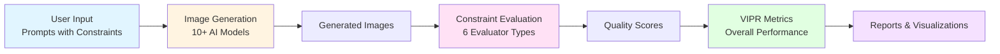
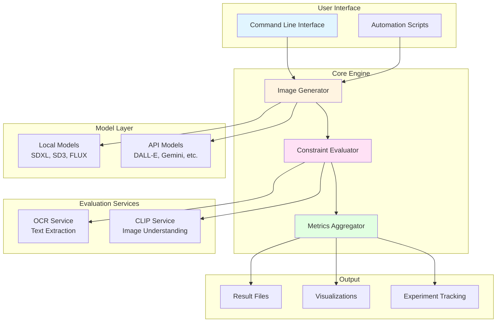
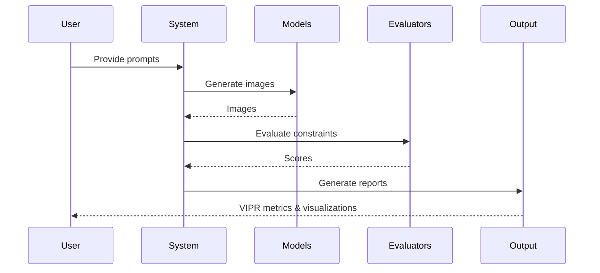

# High-Level Design (HLD)
## Visual Instruction Following Evaluation Benchmark

**Version:** 1.0  
**Date:** November 2024  
**Purpose:** Executive overview for stakeholders

> **Note:** This document uses Mermaid diagrams. If diagrams don't render on GitHub, view the raw file or use a Mermaid-compatible viewer.

---

## Executive Summary

**vis_ifeval** is a comprehensive benchmark system that evaluates how well AI image generation models follow complex visual instructions. The system tests whether generated images accurately satisfy multiple constraints (text, objects, spatial relationships, etc.) specified in natural language prompts.

### Business Value

- **Objective Model Comparison**: Compare different AI image models (DALL-E, Stable Diffusion, FLUX, etc.) on standardized tasks
- **Quality Assurance**: Validate that image generation models meet specific requirements before deployment
- **Research & Development**: Enable systematic evaluation of model improvements
- **Cost Optimization**: Identify which models perform best for specific use cases

---

## System Overview

---

## Core Workflow

### 1. **Input Phase**
- **What**: Natural language prompts with multiple constraints
- **Example**: *"A poster with 'SPRING SALE' text at top, price '$29.99' at bottom, no sugar mentioned"*
- **Volume**: 23 prompts, 143 total constraints

### 2. **Generation Phase**
- **What**: AI models generate images from prompts
- **Models Supported**: 
  - **Local**: Stable Diffusion XL, SD3, FLUX (requires GPU)
  - **Cloud APIs**: DALL-E, Gemini, NovelAI, Replicate, Stability AI (no GPU needed)
- **Output**: Generated images saved to disk

### 3. **Evaluation Phase**
- **What**: Automated checking if images satisfy constraints
- **Evaluators**:
  - **Text**: OCR reads text, checks if it matches requirements
  - **Labels**: Parses nutrition labels, validates table data
  - **Logic**: Checks mathematical consistency (e.g., percentages)
  - **Composition**: Counts objects, checks attributes, states
  - **Negative**: Verifies forbidden concepts are absent
  - **Spatial**: Validates object positions (left/right/above/below)

### 4. **Scoring Phase**
- **What**: Computes VIPR (Visual Instruction Pass Rate)
- **Metric**: Percentage of constraints successfully satisfied
- **Breakdown**: Scores by constraint type, category, and model

### 5. **Reporting Phase**
- **What**: Generates tables, charts, and visualizations
- **Outputs**: 
  - Markdown/CSV tables for papers
  - Bar charts, heatmaps
  - Weights & Biases dashboards

---

## System Architecture

### High-Level Components

---

## Key Features

### ✅ Multi-Model Support
- **10+ Models**: Test and compare multiple AI image generation models
- **Flexible Deployment**: Use local GPU models or cloud APIs
- **Unified Interface**: Same evaluation pipeline for all models

### ✅ Comprehensive Evaluation
- **6 Constraint Types**: Text, labels, logic, composition, negative, spatial
- **Automated Scoring**: No manual inspection needed
- **Objective Metrics**: Quantifiable quality measurements

### ✅ Production Ready
- **Error Handling**: Graceful degradation for missing dependencies
- **Scalability**: Can evaluate hundreds of images
- **Reproducibility**: Seed-based generation for consistent results

### ✅ Developer Friendly
- **Easy Integration**: Simple API for adding new models
- **Extensible**: Plugin architecture for new evaluators
- **Well Documented**: Comprehensive guides and examples

---

## Use Cases

### 1. **Model Selection**
**Scenario**: Choose the best image generation model for your product

**Process**:
1. Run benchmark on candidate models (DALL-E, Stable Diffusion, etc.)
2. Compare VIPR scores across constraint types
3. Select model with best performance for your use case

**Value**: Data-driven decision making, cost optimization

---

### 2. **Quality Assurance**
**Scenario**: Ensure generated images meet specific requirements

**Process**:
1. Define constraints for your use case (e.g., "must include price tag")
2. Generate images with your model
3. Evaluate constraint satisfaction
4. Identify failure modes and improve prompts

**Value**: Catch errors before deployment, improve user experience

---

### 3. **Research & Development**
**Scenario**: Measure impact of model improvements

**Process**:
1. Run benchmark on baseline model
2. Make improvements (fine-tuning, prompt engineering)
3. Re-run benchmark and compare scores
4. Quantify improvement in VIPR metrics

**Value**: Objective measurement of progress, publication-ready results

---

### 4. **Cost Analysis**
**Scenario**: Compare cost vs. performance across models

**Process**:
1. Run benchmark on multiple models (local vs. API)
2. Measure performance (VIPR) and cost per image
3. Calculate cost-effectiveness ratio
4. Optimize for budget constraints

**Value**: Maximize ROI, optimize infrastructure costs

---

## Technical Specifications

### System Requirements

| Component | Requirement |
|-----------|------------|
| **Python** | 3.10+ |
| **Local Models** | GPU with 8GB+ VRAM (optional) |
| **API Models** | Internet connection + API keys |
| **Storage** | ~1GB for code, +7-24GB per local model |
| **Memory** | 8GB RAM minimum |

### Performance Metrics

| Metric | Value |
|--------|-------|
| **Images per Hour** | 60-360 (depends on model) |
| **Evaluation Speed** | ~1-5 seconds per image |
| **Scalability** | Handles 100+ prompts easily |
| **Accuracy** | OCR: ~95%, CLIP: heuristic-based |

---

## Data Flow

---

## Integration Points

### Input
- **Prompts**: JSONL format (easy to extend)
- **Models**: Plugin architecture (easy to add new models)
- **Configuration**: Environment variables or config files

### Output
- **Files**: JSON, CSV, Markdown, PNG plots
- **APIs**: Weights & Biases integration
- **Formats**: Publication-ready tables and charts

---

## Competitive Advantages

### 1. **Comprehensive Coverage**
- Tests 6 different constraint types (most benchmarks focus on 1-2)
- Supports 10+ models (local + cloud APIs)
- 143 constraints across 23 diverse prompts

### 2. **Production Ready**
- Error handling and graceful degradation
- Automated multi-model evaluation
- Export-ready results for papers

### 3. **Extensible Architecture**
- Easy to add new models (just implement interface)
- Easy to add new evaluators (plugin system)
- Modular design for customization

### 4. **Cost Effective**
- Works with free/paid API models
- No GPU required for API-based evaluation
- Efficient batch processing

---

## Future Roadmap

### Short Term (1-3 months)
- ✅ Spatial evaluator with object detection
- ✅ Advanced OCR backends (Surya, DeepSeek)
- ✅ Web dashboard for real-time monitoring

### Medium Term (3-6 months)
- 🔲 Distributed evaluation (multi-GPU)
- 🔲 Custom constraint definition UI
- 🔲 Model fine-tuning integration

### Long Term (6-12 months)
- 🔲 Real-time evaluation API
- 🔲 Mobile app for on-device testing
- 🔲 Industry-specific benchmark suites

---

## Success Metrics

### Technical Metrics
- **VIPR Score**: Overall constraint satisfaction rate
- **Per-Type Performance**: Breakdown by constraint type
- **Latency**: Time to generate + evaluate
- **Accuracy**: Evaluator precision/recall

### Business Metrics
- **Model Comparison**: Clear winner identification
- **Cost Efficiency**: Performance per dollar
- **Time Savings**: Automated vs. manual evaluation
- **Adoption**: Number of models/evaluators added

---

## Risk Mitigation

| Risk | Mitigation |
|------|------------|
| **API Rate Limits** | Retry logic, graceful degradation |
| **Model Failures** | Error handling, fallback options |
| **Evaluation Errors** | Multiple evaluators, validation |
| **Cost Overruns** | Usage monitoring, budget alerts |
| **Dependency Issues** | Optional dependencies, clear docs |

---

## Conclusion

**vis_ifeval** provides a robust, scalable, and extensible platform for evaluating AI image generation models. It enables data-driven decision making, quality assurance, and research advancement through objective, automated evaluation.

**Key Takeaways**:
- ✅ Comprehensive evaluation of 6 constraint types
- ✅ Support for 10+ models (local + cloud)
- ✅ Production-ready with error handling
- ✅ Extensible architecture for future needs
- ✅ Publication-ready outputs

---

## Contact & Resources

- **Documentation**: See `README.md` and `API_MODELS_GUIDE.md`
- **Architecture Details**: See `ARCHITECTURE.md`
- **Quick Start**: `python -m vis_ifeval.runners.generate_images --model-name dummy`

---

*This HLD document provides a high-level overview. For technical implementation details, refer to the architecture documentation.*

